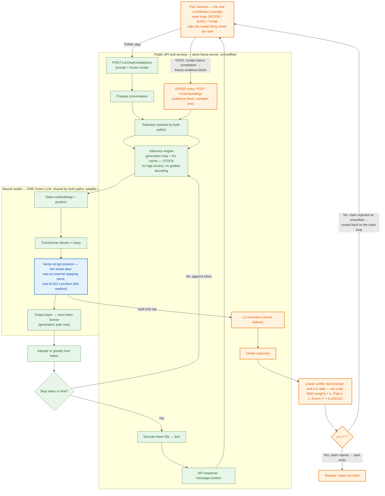

# PoC vs vanilla inference flow

Green = untouched vanilla, orange = added by the PoC, blue = changed in role.
The PoC's claim made visual: the generation spine is stock; the only new serving
surface is `/v1/embeddings`; the "verifier" is frozen data (a linear head) read
off the last-position vector, not a system component.

Footnote: in the live chain the harness talks to a thin OpenAI-compatible proxy
(`omp_proxy.py`) that carries the GATE policy and forwards to the real
llama-server; it is folded into the orange harness node above. The
`Prepare → Engine` internals are the serving system's own doing.
